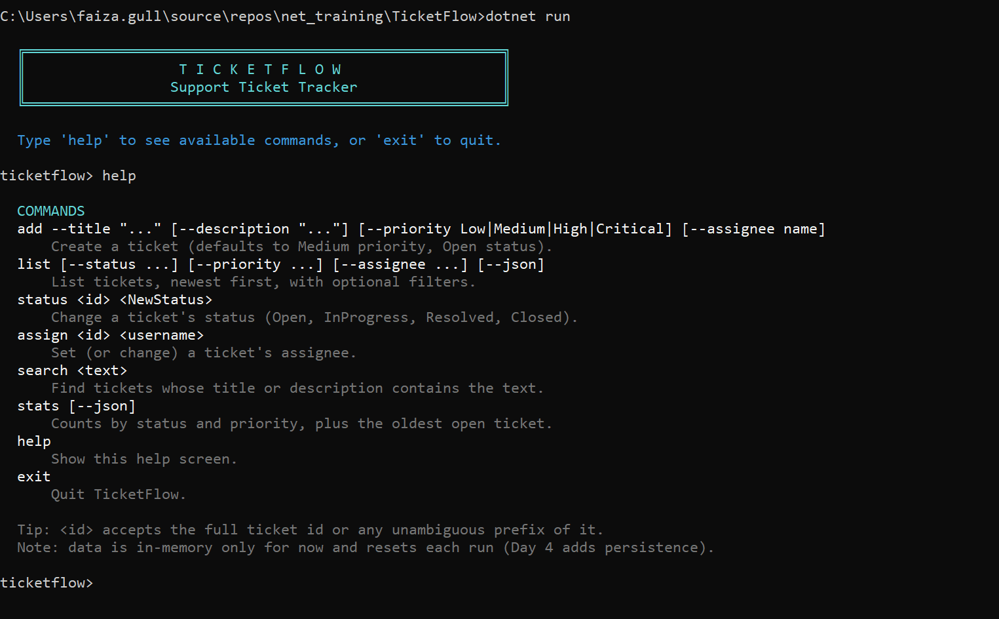
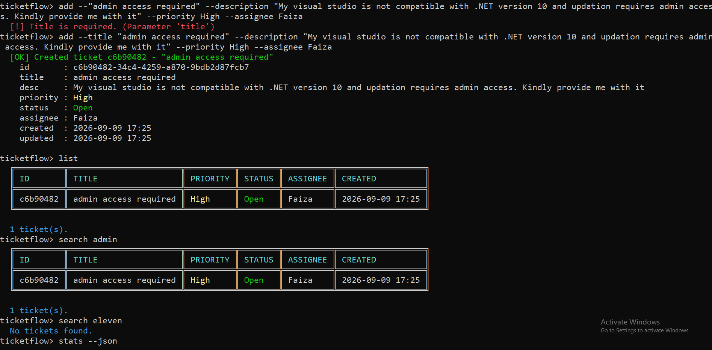
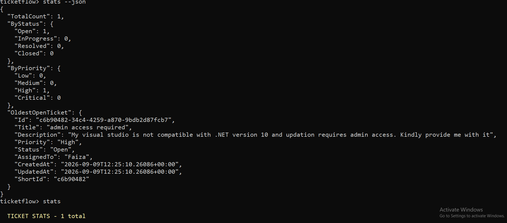
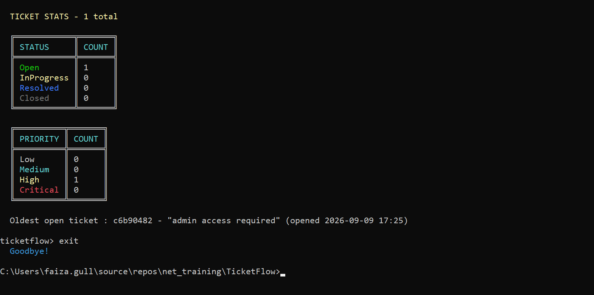

# TicketFlow (CLI)

A support-ticket tracker you run from the console. Create tickets, filter them, change
their status, assign them to people, and check overall stats.

## How to run

```
dotnet run --project TicketFlow
```

With no arguments, TicketFlow drops you into an interactive session so you can try
several commands in a row:

```
ticketflow> add --title "Login page throws 500" --priority High --assignee alice
  [OK] Created ticket a1b2c3d4 - "Login page throws 500"

ticketflow> list
  ╔══════════╦════════════════════════╦══════════╦════════╦══════════╗
  ║ ID       ║ TITLE                  ║ PRIORITY ║ STATUS ║ ASSIGNEE ║
  ╠══════════╬════════════════════════╬══════════╬════════╬══════════╣
  ║ a1b2c3d4 ║ Login page throws 500  ║ High     ║ Open   ║ alice    ║
  ╚══════════╩════════════════════════╩══════════╩════════╩══════════╝

ticketflow> status a1b2 InProgress
  [OK] Ticket a1b2c3d4 status set to InProgress.

ticketflow> exit
```

You can also run one command at a time from a regular shell - each run loads and saves
`tickets.json`, so tickets created in one call are still there in the next:

```
dotnet run --project TicketFlow -- add --title "Login page throws 500" --priority High
dotnet run --project TicketFlow -- stats
```

## Screenshots

Startup banner and `help`:



`add` (with a missing-title error first), `list`, and `search`:



`stats --json`:



`stats` as a colored table, then `exit`:



## Commands

| Command | What it does |
|---|---|
| `add --title "..." [--description "..."] [--priority Low\|Medium\|High\|Critical] [--assignee name]` | Create a ticket. Priority defaults to Medium; status always starts Open. |
| `list [--status ...] [--priority ...] [--assignee ...] [--json]` | Show tickets, newest first. Any combination of filters can be used together. |
| `status <id> <NewStatus>` | Move a ticket to Open / InProgress / Resolved / Closed. |
| `assign <id> <username>` | Set or reassign who's working on it. |
| `search <text>` | Find tickets whose title or description mentions the text. |
| `stats [--json]` | Counts per status, counts per priority, and the oldest ticket still Open. |
| `help` | Print this command list from inside the app. |
| `exit` | Leave the interactive session. |

For `<id>`, you don't need to type the full GUID - the short id shown by `list`/`add`
(or even just the first few characters, as long as they're not shared by another
ticket) is enough.

## How it's put together

```
Models/        Ticket (a record), TicketPriority, TicketStatus
Repositories/  ITicketRepository + an in-memory implementation
Services/      TicketService - the actual add/list/filter/stats logic
Cli/           turns typed input into a command, runs it, prints the result
```

The layering is deliberate: `TicketService` only knows about `ITicketRepository` (an
interface), never the concrete in-memory store - so swapping in real file or database
storage later is a new class, not a rewrite. Same idea with the console output: nothing
in `TicketService` prints or colors anything, so the logic stays testable without a
terminal attached.

`Ticket` is a record, and every change (status, assignee) produces a new copy via a
`with` expression rather than editing the ticket in place.

All repository and service methods are `async` end to end - `ITicketRepository`'s file
I/O never blocks the console loop - and `Nullable` reference types are enabled project-wide
with a zero-warning build, so missing values (a null description, an unset assignee) are
caught by the compiler rather than at runtime.

## Error handling

Every user-facing failure is surfaced as one readable `[!] ...` line instead of a stack
trace:

* **Bad CLI input** - a missing `--title`, an unknown `--priority`/status enum value, a
  ticket id that doesn't exist or that matches more than one ticket - is reported by
  `TicketService` as an `ArgumentException`/`InvalidOperationException` with the specific
  problem and (for enums) the valid values.
* **Bad tickets.json** - invalid JSON, or an entry missing a required field - is reported
  by `JsonFileTicketRepository` as a `TicketStoreCorruptException`, naming the file and,
  where possible, which entry is broken.
* **A disk/OS-level failure** (permission denied, disk full, file locked) is reported as a
  `TicketStoreIOException`.
* Both derive from the abstract `TicketStoreException`, which `CommandRouter` catches
  generically while each subclass supplies its own `RecoveryHint` shown to the user.
* **A failed save** (disk full, file locked, permissions) rolls the in-memory change back
  before reporting the error, so the app's state never claims a change was saved when it
  wasn't.

`CommandRouter` catches exactly these expected exception types around every command;
anything else is a bug and is allowed to propagate.
